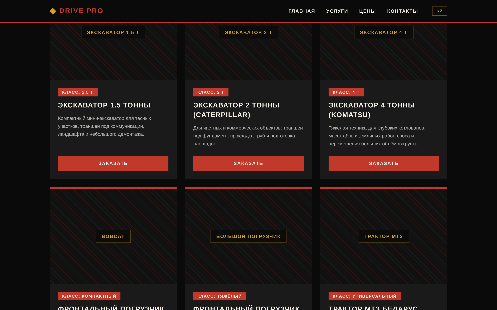

<div align="center">

# 🚜 Drive Pro — Heavy Equipment Hire

**Production marketing site for a family-run earthworks company in Almaty, Kazakhstan — 200+ projects since 2018.**

[](https://igor-vuta.github.io/drivePro-website/)


<br /><br />


</div>

---

## About the project

A real client site, not a tutorial build: Drive Pro hires out excavators (1.5 t, 2 t Caterpillar, 4 t Komatsu), Bobcat and heavy front loaders, and an MTZ Belarus tractor — operator and fuel included — for trenching, foundation pits, demolition, site clearing, and snow removal.

The site's job is simple: **turn visitors into WhatsApp enquiries**. Everything is built around that — a clear equipment catalogue, transparent pricing tables, and a persistent call-to-action.

## ✨ Features

- 🌐 **Bilingual out of the box** — Russian / Kazakh via `next-intl`, with locale-aware routing (`/ru`, `/kz`)
- 🏗 **Equipment catalogue** — cards with specs and per-unit pricing tables
- 💬 **WhatsApp-first CTA** — one tap from any section to a pre-filled enquiry
- 📱 **Fully responsive** — mobile-first layout for a customer base that browses on phones
- 🔍 **SEO-tuned** — semantic markup, locale metadata, descriptive titles
- ⚡ **Static export** — zero-server hosting on GitHub Pages, deployed automatically by CI

<div align="center">

</div>

## 🛠 Tech stack

| Layer | Tools |
|---|---|
| Framework | Next.js 14 (App Router), static export |
| Language | TypeScript |
| Styling | Tailwind CSS |
| i18n | next-intl (RU / KK), middleware-based locale routing |
| CI/CD | GitHub Actions → GitHub Pages (`basePath` configured) |

## 🚀 Run locally

```bash
npm install
npm run dev      # http://localhost:3000
npm run build    # static export to ./out
```

Deployment is automatic: every push to `main` triggers the GitHub Actions workflow that builds the static export and publishes it to GitHub Pages.

---

<div align="center">

Built by **[Igor Vuta](https://github.com/igor-vuta)** · [Portfolio](https://igor-vuta.github.io/portfolio/) · [LinkedIn](https://www.linkedin.com/in/igor-vuta-b88017390)

</div>
