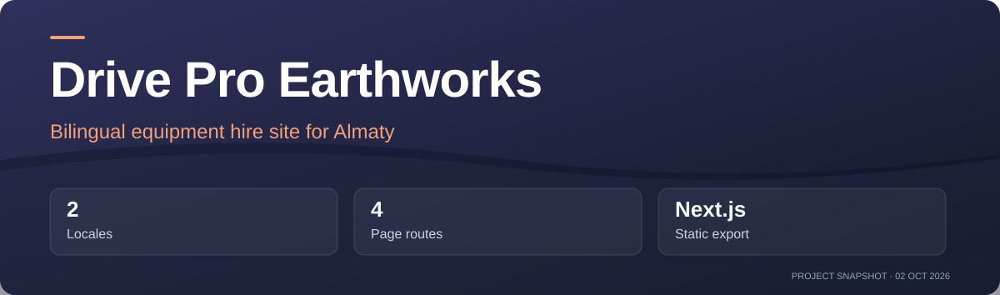
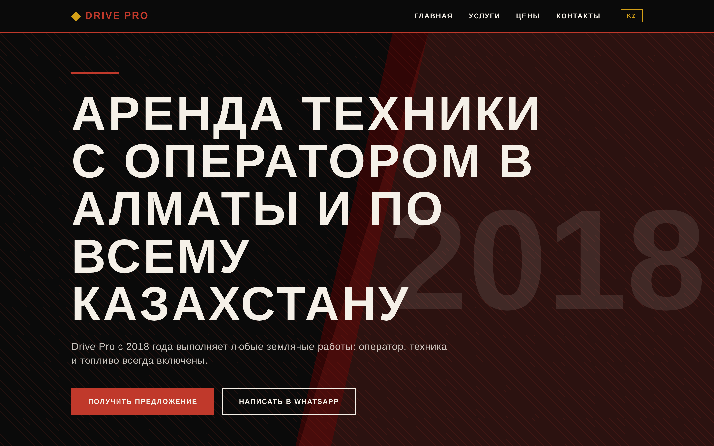
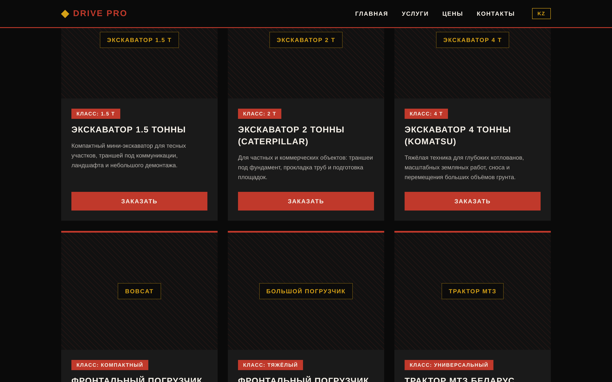

<!-- project-presentation:start -->



**[Open project](https://igor-vuta.github.io/drivePro-website/ru/)** · [Repository activity](https://github.com/igor-vuta/drivePro-website/activity)

[](https://github.com/igor-vuta/drivePro-website/commits)
[](https://github.com/igor-vuta/drivePro-website)

**3** Locales · **5** Page routes per locale · **Next.js** Static export

*Activity badges update from GitHub.*

<!-- project-presentation:end -->

<!-- project-pattern:start -->



<!-- project-pattern:end -->

<div align="center">

# 🚜 Drive Pro — Earthworks and mopeds

**Almaty website for excavator work with our operator and moped enquiries.**

[](https://igor-vuta.github.io/drivePro-website/)


</div>

---

## About the project

The site gives visitors separate routes for excavator and earthworks enquiries and mopeds. Excavator work is offered only with our operator; each job is quoted individually after the task and site conditions are discussed. Moped details can be checked through the linked Instagram profile or by contacting Drive Pro directly. The site does not present fixed prices, current stock or a live social feed.

The screenshots below show an earlier site layout and are kept as project history.

<div align="center">

</div>

## Site features

- Russian, Kazakh and English pages under `/ru`, `/kz` and `/en`; Kazakh pages declare `lang=kk`.
- Separate earthworks, quote, moped and contact pages in every locale.
- Optional excavator brief with an editable WhatsApp draft, plus direct phone and WhatsApp actions.
- Per-route canonical and language alternate metadata, sitemap and robots file.
- Static export under `/drivePro-website` for GitHub Pages.

<div align="center">

</div>

## Tech stack

| Layer | Tools |
|---|---|
| Framework | Next.js 16 (App Router), static export |
| Language | TypeScript |
| Styling | Tailwind CSS |
| i18n | next-intl (RU / KK / EN), generated locale routes |
| Hosting | GitHub Pages with `/drivePro-website` base path |

## Run locally

```bash
fnm use
npm ci
npm run dev
```

Before updating the Pages build, run `npm run audit`, `npm run lint`, `npm run typecheck`, `npm test`, `npm run build` and `npm run check:export`. The export is written to `out/`. The existing GitHub Actions workflow builds and checks the site before its push-triggered Pages deployment.

---

<div align="center">

Built by **[Igor Vuta](https://github.com/igor-vuta)** · [Portfolio](https://igor-vuta.github.io/portfolio/) · [LinkedIn](https://www.linkedin.com/in/igor-vuta-b88017390)

</div>
